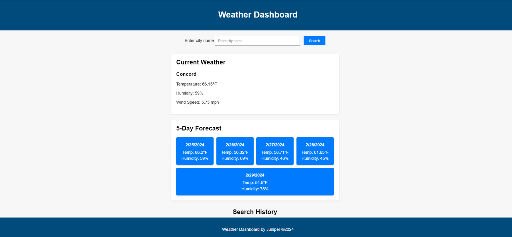

# Juniper's Five Day Weather Dashboard

## Description

This Weather Dashboard is a web application that allows users to search for and view current weather conditions and a 5-day forecast for any city. The application uses the OpenWeather API to retrieve weather data and display it in a user-friendly interface.

## Features

- Search functionality for finding current weather data by city name.
- Display of current weather conditions including temperature, humidity, wind speed, and more.
- A 5-day weather forecast that shows temperature, wind, and humidity.
- A search history that saves previous searches.

## Usage
To use the Weather Dashboard:

1. Visit <a href="https://juniperwrenmcgill.github.io/Weather-Dashboard/" target="_blank"> [https://juniperwrenmcgill.github.io/Weather-Dashboard/].</a>
2. Enter the name of the city in the search bar.
3. Click on the 'Search' button to retrieve weather data.
4. View the current weather conditions displayed at the top section.
5. Scroll down to see the 5-day weather forecast.
6. Recently serched cities are saved with local storage and avaible on refresh. 

## Technologies Used

- HTML
- CSS
- JavaScript
- OpenWeather API

## License
Distributed under the MIT License. 

## Contact
For any questions, please contact me on GitHub at [JuniperWrenMcGill](https://github.com/JuniperWrenMcGill) 